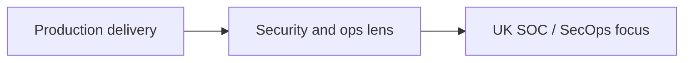

<div align="center">

<a href="https://muizmunshi.vercel.app" title="Portfolio">
  
</a>

<br/>

**London, UK** · BSc (Hons) Computer Science (First Class)

<br/>

<a href="https://muizmunshi.vercel.app" title="Live portfolio">
  
</a>
<a href="https://www.linkedin.com/in/abdul-muiz-munshi-6ab4141b8" title="LinkedIn">
  
</a>
<a href="mailto:muizmunshi@gmail.com" title="Email">
  
</a>
<a href="https://github.com/muiz2353673" title="Repositories">
  
</a>

</div>

---

## In one flow

I ship **real software** (APIs, data, **AWS**, **Docker**) and I know **requirements, user stories, and process mapping**. I do not treat security as theory: I think about **who can access what**, **what fails in production**, and **what you need in logs** for triage and investigation.



<details>
<summary><strong>At a glance (click to expand)</strong></summary>

```yaml
Name: Abdul Muiz Munshi
Location: London, United Kingdom
Education: BSc (Hons) Computer Science - First Class Honours
Focus: Software delivery + security and operations (SOC-oriented)
Aim: UK SOC / security operations and security-adjacent engineering
```

</details>

---

<details open>
<summary><strong>About me</strong></summary>

First-Class Computer Science graduate and full-stack software engineer. I know how services are put together, how they break in production, and what signals you need in logs to explain behaviour, abuse, or failure. I make risk-aware calls under time pressure, work from evidence, and communicate clearly. I am moving deliberately into **UK SOC and security operations** roles: monitoring, log analysis, incident triage, and escalation, with a production engineer's view of systems, not security theory alone.

Comfort with the delivery lifecycle means I can work with product and engineering without hand-waving. I look for **trust boundaries**, **misuse cases**, and **operational failure modes**: what you would need in traces and log lines to see an issue, not just a diagram on a slide.

I am based in **London** and have worked across support and digital leadership roles with high contact volume, **triage**, and **escalation**, which maps well to structured handover in tiered operations teams.

</details>

---

<details>
<summary><strong>Security and systems thinking</strong></summary>

I reason about where systems are weak, what to monitor, and how to separate signal from noise. Typical framing (aligned with a SOC or security operations context):

- **Attack surfaces:** APIs, authentication and sessions, admin paths, and anything exposed by misconfiguration, not just the network edge.
- **Least privilege and access control:** over-broad roles, shared credentials, and separation of duties gaps that show up in real incidents.
- **Logging and monitoring:** what to record, what to alert on, and which questions a timeline should answer when something looks wrong.
- **Cloud and infrastructure:** AWS, Docker, and networking as part of the picture, including misconfiguration and exposure, not only application bugs.
- **Debugging as investigation:** hypothesis, evidence, and narrowing scope, in line with structured handling in a tiered team.

</details>

---

<details>
<summary><strong>Security-focused experience (Botium Toys case study)</strong></summary>

**Security assessment: Botium Toys (case study)**  
Structured review across people, process, and technology. Retail-style scenario: on-prem and online systems, infrastructure, and physical access paths, mapped to **PCI DSS**, **GDPR**, and **SOC**-type expectations, with prioritised recommendations.

- Led a structured security and controls assessment: coverage included systems, infrastructure, and physical access where relevant.
- Recorded material weaknesses: access control, encryption, backup/DR gaps, and limited **IDS-style** network visibility, constraining detection of malicious or anomalous activity.
- **SOC angle:** the same **logging, monitoring, and detection** gaps are what leave teams blind in real operations. Improving that is as much a telemetry and engineering problem as a policy exercise.

</details>

---

<details>
<summary><strong>What I do professionally</strong></summary>

- **Production delivery** at **Letterbox Distribution**: features shipped in a live product context (requirements, user stories, process mapping, Agile sprints), with a habit of asking where trust boundaries are, what misuse cases exist, and what you would need in logs and traces to see a failure.
- **First-line and research experience** (university and internships): high-volume contact, triage, short written notes, and escalation on a clear path, comparable to initial classification and handover discipline in operations workflows.
- **Technical collaboration:** APIs, integration patterns, and stack traces; enough depth to work with code and discuss fixes without bluffing.

</details>

---

## Stack and tools

<div align="center">


<br/>


</div>

<details>
<summary><strong>Core skills (text)</strong></summary>

**Security and systems:** attack surfaces, least privilege, logging and monitoring gaps, incident-relevant questions.  
**Engineering:** Python, JavaScript, Java, SQL; React, Spring Boot, Laravel, REST APIs; Git and GitHub; data analysis and reporting (Pandas, notebooks as used).  
**Infrastructure:** Docker, AWS, Linux; misconfiguration and exposure as part of the operations picture.  
**Delivery and communication:** Agile/Scrum, workshops, requirements and user stories; Jira, Confluence, Miro, Lucidchart; clear writing for handover and shift notes.

</details>

---

## Selected projects

Full write-ups with **auth, data, and monitoring angles** live on the **[portfolio](https://muizmunshi.vercel.app)** (each project has a security and operations lens).

| Project | One line |
|--------|----------|
| **Beaccon** (council and community) | Production platform: requirements, process mapping, delivery; auth, PII, APIs, and logging. |
| **Internal office website** | Hub for 10-12 staff; 50-80% less time finding resources; access and monitoring notes on site. |
| **Noted.AI** (in progress) | Requirements and scope; third-party AI, data retention, operational signals. |
| **Movie recommender** | Data/ML: evaluation, data-handling, and job/artefact risks. |
| **More** (Spring Boot, server monitoring, event app, hotel ML) | See GitHub; summarised on portfolio with **risks and monitoring** notes, not a claim that every control is in every repo. |

---

## Roles I am interested in

UK **SOC and security operations** where **monitoring, log analysis, incident detection**, and **clear escalation** matter. Open to **security-adjacent engineering** with one foot in production reality.

<details>
<summary><strong>Target roles and what I bring (expand)</strong></summary>

- SOC analyst (Tier 1 / entry)
- Security operations centre analyst
- Junior security analyst (operations)
- IT support / NOC to SOC path
- Cloud security (operations-leaning)
- DevSecOps (delivery with security and monitoring)

**What I bring:** evidence and triage from first-line and research roles; **engineering context** (APIs, cloud-style deployments, log-friendly debugging); **communication** and user-story discipline for handover; **security assessment practice** (Botium: controls, gaps, SOC-relevant visibility).

</details>

---

<div align="center">

### Connect

| | |
|:---|:---|
| **Portfolio** | [**muizmunshi.vercel.app**](https://muizmunshi.vercel.app) |
| **LinkedIn** | [**linkedin.com/in/abdul-muiz-munshi-6ab4141b8**](https://www.linkedin.com/in/abdul-muiz-munshi-6ab4141b8) |
| **GitHub** | [**github.com/muiz2353673**](https://github.com/muiz2353673) |
| **Email** | [**muizmunshi@gmail.com**](mailto:muizmunshi@gmail.com) |

<br/>

<sub>README matches my live portfolio. For the latest copy and long-form project notes, open the site above.</sub>

</div>
- **Technical collaboration:** APIs, integration patterns, and stack traces; enough depth to work with code and discuss fixes without bluffing.

---

## Core skills and tools

**Security and systems:** attack surfaces, least privilege, logging and monitoring gaps, incident-relevant questions.

**Engineering:** Python, JavaScript, Java, SQL; React, Spring Boot, Laravel, REST APIs; Git and GitHub; data analysis and reporting (Pandas, notebooks as used).

**Infrastructure:** Docker, AWS, Linux; misconfiguration and exposure as part of the operations picture.

**Delivery and communication:** Agile/Scrum, workshops, requirements and user stories; Jira, Confluence, Miro, Lucidchart; clear writing for handover and shift notes.

`Jira` · `Confluence` · `Miro` · `Lucidchart` · `Agile / Scrum` · `REST` · `Docker` · `AWS` · `Git` · `GitHub`

---

## Selected projects

Full write-ups with security, auth, and monitoring angles: **[muizmunshi.vercel.app](https://muizmunshi.vercel.app)** (portfolio).

| Project | One line |
|--------|----------|
| **Beaccon** – council and community platform | Production platform for operations and resident engagement: requirements, process mapping, delivery; auth, PII, APIs, and logging considered in the portfolio. |
| **Internal office website** | Single hub for 10-12 staff; estimated 50-80% reduction in time spent finding resources; access, data handling, and monitoring notes on the site. |
| **Noted.AI** (in progress) | Product-style requirements and scope; third-party AI, data retention, and operational signals. |
| **Movie recommendation system** | Data/ML: evaluation, data-handling, and job/artefact risks. |
| **Spring Boot, server monitoring, event tracker, hotel cancellation ML** | Further repos on GitHub; each summarised on the portfolio with **identified risks** and **monitoring** notes, not a claim that every control is fully implemented in every repository. |

---

## Roles I am interested in

UK-based **SOC and security operations** roles where **monitoring, log analysis, incident detection**, and **clear escalation** matter. I am also open to **hybrid security-adjacent engineering** paths that keep one foot in production reality.

- SOC analyst (Tier 1 / entry)
- Security operations centre analyst
- Junior security analyst (operations)
- IT support / NOC to SOC path
- Cloud security (operations-leaning)
- DevSecOps (delivery with security and monitoring)

**What I bring:** evidence and triage habits from first-line and research roles; **engineering context** (APIs, cloud-style deployments, log-friendly debugging); **communication** and user-story discipline for handover; **security assessment practice** (Botium case study: controls, gaps, and SOC-relevant visibility).

---

## Connect

| | |
|---|---|
| **Portfolio** | [muizmunshi.vercel.app](https://muizmunshi.vercel.app) |
| **LinkedIn** | [linkedin.com/in/abdul-muiz-munshi-6ab4141b8](https://www.linkedin.com/in/abdul-muiz-munshi-6ab4141b8) |
| **GitHub** | [github.com/muiz2353673](https://github.com/muiz2353673) |
| **Email** | [muizmunshi@gmail.com](mailto:muizmunshi@gmail.com) |

---

*This README mirrors my live portfolio. For the latest wording and project detail, see the site above.*
